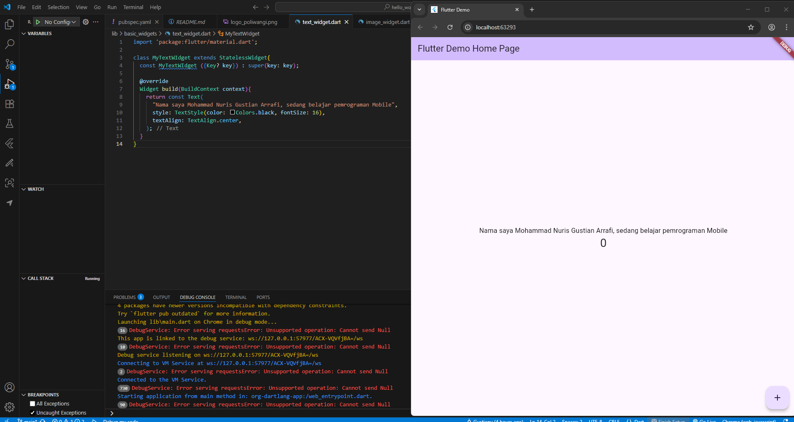

# hello_world

a new flutter project

#### MEMBUAT PROJECT FLUTTER BARU 
**Langkah 1:**
Buka VScode, lalu tekan CTRL + SHIFT + P maka akan tampil command palette, lalu ketik FLUTTER. Pilih NEW APPLICATION PROJECT
 

 
 

 
 
 

**Langkah 2:**
Kemudian buat folder sesuai style laporan praktikum yang anda piih. Disarankan folder dokumen atau dekstop atau alamat folder lain yang tidak terlalu dalam atau panjang. Lalu pilih SELECT A FOLDER TO CREATE THE PROJECT IN

 
 
 

**Langkah 3:**
Buat nama project flutter HELLO_WORLD seperti berikut, lalu tekan ENTER. Tunggu hingga proses pembuatan project selesai

 
 
 

**Langkah 4:**
Jika sudah selesai proses pembuatan baru, pastikan tampilan seperti berikut. Pesan akan tampil berupa "YOUR FLUTTER PROJECT IS READY!" artinya anda telah berhasil membuat project flutter baru.

 
 
 
 

#### MENERAPKAN WIDGET DASAR
**Langkah 1: Text Widget**
Buat folder baru BASIC_WIDGETS di dalam folder **lib**. kemudian buat file baru didalam basic_widgets dengan nama **text_widget.dart**. ketik atau salin kode program berikut ke project hello_world Anda pada file **text_widget.dart**.

Lakukan import file **text_widget.dart**  ke main.dart, lalu ganti bagian text widget dengan kode diatas. Maka hasilnya seperti gambar berikut. Screenshot hasil milik anda, lalu dibuat laporan pada file README.md.

 
 
 

**Langkah 2: Image Widget**
Buat sebuah file **image_widget.dart** didalam folder basi_widgets dengan isi kode berikut.

Lakukan penyesuaian asset pada file **pubspec.yaml** dan tambahkan file logo anda di folder ASSETS project hello_world.

 
 

Jangan lupa sesuaikan kode dan import di file **main.dart**.

 
 
 
 

#### MENYAMBUNGKAN FLUTTER DENGAN EMULATOR ATAU ANDROID STUDIO
**Langkah 1:**
Buka ANDROID STUDIO dan pilih menu plugin pada bagian kiri pada posisi nomer 3 dari atas

 
 
 

**Langkah 2:**
Pada bagian tab marketplace ketik pada pencarian yang memiliki simbol kaca pembesar dan ketikkan **Flutter** dan pilih flutter dan install flutter tunggu hingga selesai download, setelah selesai download maka akan ada tombol **restart ide** maka **restart ide**

 
 
 

**Langkah 3:**
Setelah selesai restart Android Studio pilih **open** yang memiliki simbol plus(+).

 
 

Pilih project flutter yang telah dibuat sebelumnya dan klik **select folder**

 
 
 

**Langkah 4:**
Jika muncul gambar seperti dibawah pada bagian atas halaman Android Studio, maka pilih **Get Dependencies**

 
 
 

**Langkah 5:**
Pilih **Device manager** pada bagian samping nomer 2 dari atas dan pilih simbol **plus (+)**, pilih **create virtual device**.

 
 

Setelah itu pilih device, setelah memilih device pilih next

 
 

Setelah itu pilih **Finish**

 
 
 

**Langkah 6:**
Pilih **tombol panah kekanan** pada device yang telah di pilih tadi untuk menampilkan emulator sesuai device yang dipilih.

 
 

berikut tampilan device ketika dijalankan

 
 
 

**Langkah 7:**
Untuk menjalankan project flutter yang telah dibuat sebelumnya, pilih device terlebih dahulu setelah itu pilih simbol panah kekanan.

 
 

Ketika dijalankan akan terlihat seperti pada gambar dibawah

 
 
 

